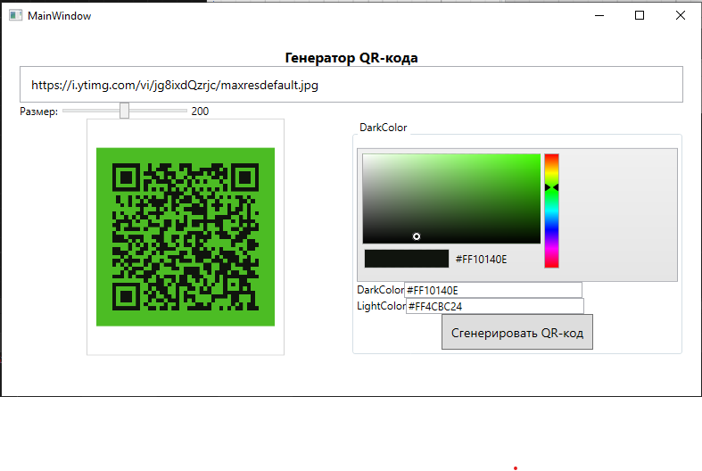

# QrCodeMaker
Десктопное приложение для создания стилизованных цветных QR-кодов с поддержкой пользовательских цветов и экспорта в изображение
# 🎨 Генератор цветных QR-кодов на C#


Простое и стильное **десктопное приложение на C#**, которое создаёт **цветные QR-коды** — идеально для визиток, презентаций, рекламы и цифровых кампаний.

✨ Добавь цвет, логотип и фирменный стиль — и получи QR, который выделяется!

## 🖼 Пример


## 🖼 Интерфейс



## 🚀 Возможности

- ✅ Генерация QR-кода из текста или URL
- 🎨 Настройка цвета кода и фона
- 🖱 Удобный графический интерфейс (WPF)
- 💾 Локальное сохранение без интернета

---

## 🛠 Технологии

- **C# (.NET 6)**
- **WPF**
- Библиотеки:
- [`CommunityToolkit.Mvvm`](https://github.com/CommunityToolkit/dotnet)  
  Современная реализация паттерна MVVM для .NET. Упрощает привязку данных, команды и навигацию в WPF-приложениях. Ранее известна как `Microsoft MVVM Toolkit`.

- [`Extended.Wpf.Toolkit`](https://github.com/xceedsoftware/wpftoolkit)  
  Популярный набор расширенных элементов управления для WPF (цветовые пикеры, датчики, водопады и др.). Используется для удобного выбора цветов в интерфейсе.

- [`QRCoder`](https://github.com/codebude/QRCoder)  
  Простая и надёжная библиотека для генерации QR-кодов в .NET. Поддерживает кастомизацию, логотипы и разные режимы кодирования.

- [`SixLabors.ImageSharp`](https://sixlabors.com/products/imagesharp)  
  Мощная библиотека для обработки изображений в .NET (аналог `System.Drawing` без зависимости от GDI+). Используется для рисования цветных QR-кодов и наложения логотипов.

- [`QRCoder.ImageSharp`](https://www.nuget.org/packages/QRCoder.ImageSharp/)  
  Официальное расширение `QRCoder` для интеграции с `ImageSharp`. Позволяет генерировать QR-изображения напрямую в формате `Image<Rgba32>` с поддержкой прозрачности и высокого качества.
  
- `System.Drawing.Common` — для обработки изображений
- Поддержка **прозрачных PNG** (формат `PNG` с `Alpha`)
- Кроссплатформенно (если .NET 6+ и не использует WinForms)

---

## 📦 Установка и запуск

### 🔧 Требования
- .NET 6.0+

### 📥 Скачать и запустить

```bash
# Клонировать репозиторий
git clone https://github.com/D1n976/QrCodeMaker.git

# Собрать проект
dotnet build

# Запустить
dotnet run
